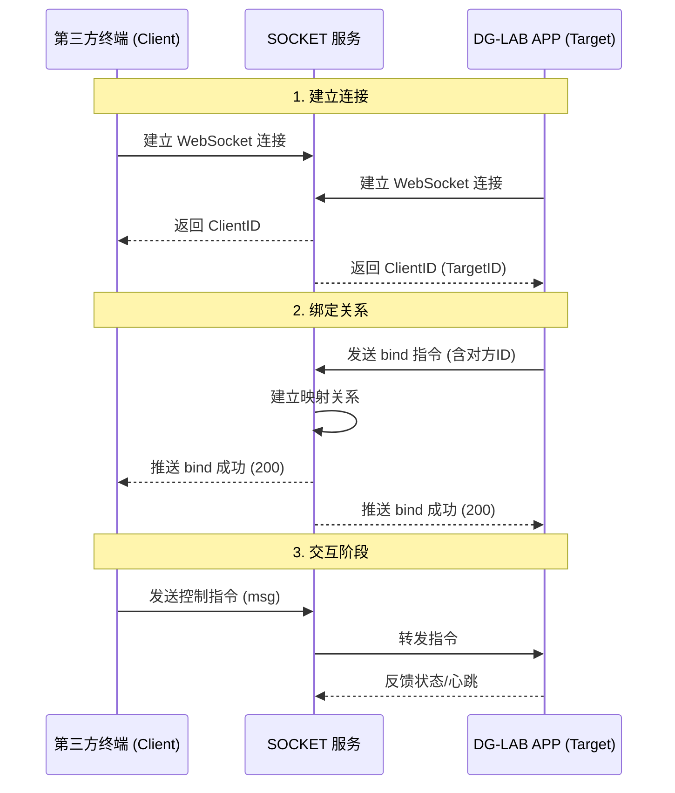

# 🌐 SOCKET 控制 - 控制端开源 (V3)

::: info 适用范围
本功能仅支持 **郊狼脉冲主机 3.0**。
:::

## 📖 方案说明

**SOCKET 控制**允许 DG-LAB APP 通过 WebSocket 服务连接到第三方控制端。
这是一个 **N (APP) ↔ SOCKET ↔ N (第三方)** 的中转方案，支持局域网或公网控制，便于多人互动。

### 项目架构

- **前端控制**：负责逻辑控制、UI 展示、指令生成。
- **SOCKET 后端**：负责 ID 关系绑定、数据转发。

::: details 📂 官方开源项目目录结构
- `/socket/BackEnd(Node)`: 后端代码 (Node.js)
  - 部署指南: `document.txt`
- `/socket/FrontEnd(Html+Css+Js)`: 前端代码
  - 部署指南: `document.txt`


:::

### 连接交互流程




## 📡 通用通信协议 (JSON)

所有数据交互均采用 JSON 格式。

### 基础数据结构

```json
{
  "type": "xxx",
  "clientId": "发送方ID",
  "targetId": "接收方ID",
  "message": "内容负载"
}
```

::: warning 约束条件
1. **长度限制**：JSON 字符串最大长度 **1950**，超出将被丢弃。
2. **字段要求**：除 SOCKET 返回 ID 阶段外，所有指令必须包含上述 4 个 Key，且 Value 不可为空。
3. **ID 规范**：推荐使用 UUID v4 (32位) 确保唯一性。
:::

### 消息类型 (type) 定义

| Type | 含义 | 说明 |
| :--- | :--- | :--- |
| `heartbeat` | 心跳包 | 保持长连接活跃 |
| `bind` | 关系绑定 | 建立终端与 APP 的配对 |
| `msg` | 业务消息 | 包含波形、强度、反馈等核心指令 |
| `break` | 断开连接 | 主动断开通知 |
| `error` | 服务错误 | 异常情况反馈 |

---

## 🔗 绑定流程详解

### 1. 获取身份 (ID)
客户端/APP 连接 Socket 后，服务器会立即下发身份 ID。

```json
// Server -> Client/APP
{
  "type": "bind",
  "clientId": "xxxx-xxxx-xxxx-xxxx", // 服务器分配的唯一ID
  "targetId": "",
  "message": "targetId"              // 标识这是一个ID分配消息
}
```

### 2. 发起绑定 (APP端操作)
APP 扫描终端二维码获得终端 ID 后，向服务器发起绑定请求。

```json
// APP -> Server
{
  "type": "bind",
  "clientId": "终端ID (二维码获取)",
  "targetId": "APP ID (自身)",
  "message": "DGLAB"
}
```

### 3. 绑定确认
服务器向双方广播绑定结果。

```json
// Server -> Client & APP
{
  "type": "bind",
  "clientId": "终端ID",
  "targetId": "APP ID",
  "message": "200" // 200 表示成功
}
```

---

## 📤 状态同步 (APP ➔ 第三方)

当 APP 端调整强度或修改上限时，会推送状态给第三方。

```json
{
  "type": "msg",
  "clientId": "APP ID",
  "targetId": "终端ID",
  "message": "strength-11+7+100+35"
}
```

**Message 解析：** `strength-A强度+B强度+A上限+B上限`
- **示例解释**：
  - A通道强度: **11** (上限 100)
  - B通道强度: **7** (上限 35)

---

## 📥 核心控制指令 (第三方 ➔ APP)

::: danger 格式严格
所有指令必须严格按照下述格式拼接字符串，非法指令将被 APP 直接丢弃。
:::

### 1. 强度控制

```json
{
  "type": "msg",
  ...
  "message": "strength-1+1+5"
}
```

**Message 格式：** `strength-{通道}+{模式}+{数值}`

| 字段 | 值 | 含义 |
| :---: | :---: | :--- |
| **通道** | `1` | A 通道 |
| | `2` | B 通道 |
| **模式** | `0` | 减少强度 |
| | `1` | 增加强度 |
| | `2` | 设置为指定值 |
| **数值** | `0-200` | 变化的量 或 目标值 |

**示例：**
- `strength-1+1+5`：A 通道强度增加 5
- `strength-2+2+0`：B 通道强度归零
- `strength-2+0+20`：B 通道强度减少 20
- `strength-1+2+35`：A 通道强度设定为 35

### 2. 波形输出

```json
{
  "type": "msg",
  ...
  "message": "pulse-A:[\"0900000000640064\", \"0900000000640064\", ...]"
}
```

**Message 格式：** `pulse-{通道}:{JSON数组字符串}`

- **通道**：`A` 或 `B`。
- **数据**：必须是 [V3 蓝牙协议](/coyote-v3) 中定义的 **8 字节 HEX 字符串**。
- **限制**：数组最大长度 **100** (约 10秒)。
- **队列**：APP 内部缓冲队列最大 **500** 条。

::: tip 发送策略
每条 HEX 数据代表 **100ms**。为防止网络延迟造成卡顿，建议发送频率略快于播放时长（例如每 0.9秒 发送 10条数据）。
:::

### 3. 清空队列

紧急停止或切换模式时使用。

```json
{
  "type": "msg",
  ...
  "message": "clear-1"
}
```
- `clear-1`: 清空 A 通道
- `clear-2`: 清空 B 通道

::: warning 时序注意
清空指令后，建议等待少量时间再发送新波形，防止网络乱序导致“先收到了波形，后收到了清空”。
:::

### 4. 按钮反馈 (APP ➔ 第三方)

当用户点击 APP 内的图形按钮时触发。

```json
{
  "type": "msg",
  ...
  "message": "feedback-0"
}
```
- **0~4**: A 通道的 5 个按钮。
- **5~9**: B 通道的 5 个按钮。

---

## 📱 二维码生成规范

为了让 APP 能够识别并连接，二维码内容必须严格符合以下格式：

`https://www.dungeon-lab.com/app-download.php#DGLAB-SOCKET#wss://ws.dungeon-lab.cn/xxxx-xxxx`

**结构拆解：**
1. **下载页头**：`https://www.dungeon-lab.com/app-download.php`
2. **分隔符**：`#`
3. **协议标签**：`DGLAB-SOCKET`
4. **分隔符**：`#`
5. **完整Socket地址**：`wss://ws.dungeon-lab.cn/{终端ID}`

::: danger 严禁修改
- 必须且仅能包含 **两个** `#` 分隔符。
- Socket 地址中，域名与 ID 之间**不得**添加额外路径（如 `/socket/`）。
- 不得添加任何额外的空格或参数。
:::

---

## 🛠️ 附录

### 错误码定义

| Code | 描述 | 原因排查 |
| :---: | :--- | :--- |
| **200** | 成功 | 一切正常 |
| **209** | 对方已断开 | APP 或 网页端关闭 |
| **210** | 无效 ClientID | 二维码中未包含 ID |
| **211** | 绑定超时 | 连接成功但服务器未下发 ID |
| **400** | ID 被占用 | 该 ID 已有其他连接 |
| **401** | 目标不存在 | 尝试绑定的 TargetID 离线 |
| **402** | 未绑定 | 双方未建立绑定关系就发送消息 |
| **403** | 格式错误 | 发送的不是 JSON 对象 |
| **404** | 找不到收信人 | 对方可能掉线 |
| **405** | 消息过长 | Message 超过 1950 字符 |
| **500** | 服务器异常 | 后端服务错误 |

::: details 🧩 参考：官方前端代码的特殊协议
如果你直接使用官方提供的 `FrontEnd(Html+Css+Js)` 代码，前端 JS 与 Node 后端之间的通信格式与上述标准协议略有不同（后端会帮你转换）：

**1. 强度操作**
- `message`: 必须为 `'set channel'`
- `channel`: `1`(A) 或 `2`(B)
- `type`:
    - `1`: 减少 (strength 强制为 1)
    - `2`: 增加 (strength 强制为 1)
    - `3`: 归零
    - `4`: 指定值
- `strength`: 数值

**2. 波形数据**
- `type`: `'clientMsg'`
- `message`: A 通道 HEX 数组 JSON
- `message2`: B 通道 HEX 数组 JSON
- `time1` / `time2`: 持续时长
- *注：后端默认以 200ms 间隔下发*

**3. 清空队列**
- `type`: `'msg'`
- `message`: `'clear-1'` 或 `'clear-2'`
:::